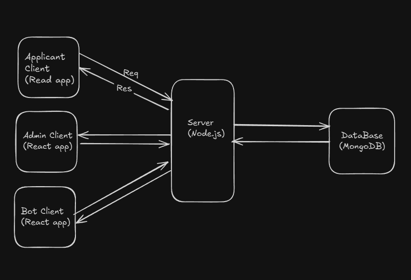
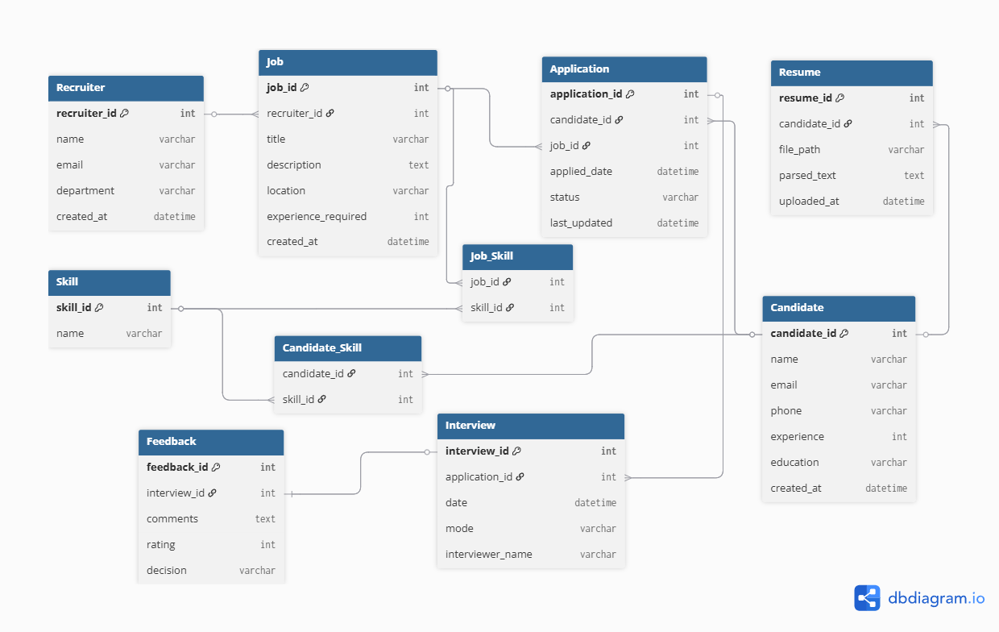

# ATS (Application Tracking System) — Multi-Client Platform

The **ATS Multi-Client System** is a complete recruitment management platform built using the **MERN stack**.  
It allows companies to manage their hiring process efficiently by connecting **Applicants**, **Admins**, and **Recruitment Bots** within a unified ecosystem.

## Key Features

### Applicant

- Register and log in to the applicant dashboard.
- Browse available job openings and apply instantly.
- Track application history with real-time updates.
- View analytical insights (Pie chart and Histogram) about their applications.

### Admin

- Register and log in as admin.
- Post new job openings and manage existing listings.
- View and filter all incoming applications.
- Update application statuses (Accepted / Rejected / Under Review).
- Leave review comments on applications.

### Bot

- Automate status updates for **technical roles** based on pre-defined logic.
- Manage applicant review data through backend integration.
- Operates as an AI-assisted recruiter for repetitive workflow tasks.

## Architecture Overview

- The project follows a **multi-client monorepo architecture** under a single project root named **`Application Tracking System`**, with one backend and three frontend clients — each serving a specific role.




## Project Structure

```
job_application_app/
├── server/                 # Backend API (Express + MongoDB)
│   ├── config/            # Database configuration
│   ├── middleware/        # Authentication middleware
│   ├── models/           # MongoDB models
│   ├── routes/           # API routes
│   └── server.js         # Main server file
├── client/               # Original applicant client (React)
├── admin_client/         # Admin client (React + Tailwind)
├── bot_client/           # Bot client (React + Tailwind)
└── README.md            # This file
```

## Features by Client

### 🔧 Backend API (`server/`)

- **Express.js** server with MongoDB
- **JWT-based authentication** with role-based access control
- **REST APIs** for all three client types
- **Swagger documentation** at `/api-docs`
- **CORS configuration** for all clients

### 👤 Applicant Client (`client/`)

- User registration and login
- Browse available job roles
- Apply for positions with experience/skills
- View application history and status
- Real-time status updates

### 👨‍💼 Admin Client (`admin_client/`)

- Admin login and dashboard
- **Job Management**: Create, update, delete job roles
- **Application Management**: View and update non-technical applications
- **Analytics**: Charts and statistics
- **Comments**: Add notes to application updates

### 🤖 Bot Client (`bot_client/`)

- Bot authentication
- **Automated Processing**: Technical application workflow
- **Auto Mode**: Scheduled automation (30-second intervals)
- **Manual Triggers**: One-click automation
- **Activity Logs**: Real-time bot activity monitoring

## Quick Start

### 1. Backend Setup

```bash
cd server
npm install
cp .env.example .env  # Configure MongoDB and JWT secret
npm run dev
```

### 2. Applicant Client Setup

```bash
cd client
npm install
cp .env.example .env  # Set VITE_API_URL
npm run dev
```

### 3. Admin Client Setup

```bash
cd admin_client
npm install
cp env.example .env   # Set VITE_API_URL
npm run dev
```

### 4. Bot Client Setup

```bash
cd bot_client
npm install
cp env.example .env   # Set VITE_API_URL
npm run dev
```

## Environment Variables

### Backend (`server/.env`)

```env
PORT=5000
MONGODB_URI=mongodb://localhost:27017/ats
JWT_SECRET=your_jwt_secret_here
```

### Frontend Clients (`.env`)

```env
VITE_API_URL=http://localhost:5000
```

## User Roles

1. **Applicant** (`applicant`): Can register, login, view jobs, apply, check status
2. **Admin** (`admin`): Can login, manage jobs, update non-technical applications
3. **Bot** (`bot`): Can login, automate technical application processing

## API Endpoints

### Authentication

- `POST /api/auth/register` - User registration
- `POST /api/auth/login` - User login
- `GET /api/auth/me` - Get current user

### Applications

- `POST /api/applications` - Create application (Applicant)
- `GET /api/applications` - Get user's applications (Applicant)
- `GET /api/applications/all` - Get all applications (Admin)

### Admin

- `GET /api/admin/dashboard-stats` - Dashboard statistics
- `GET /api/admin/job-roles` - Get all job roles
- `POST /api/admin/job-roles` - Create job role
- `GET /api/admin/non-technical-applications` - Get non-technical applications
- `PATCH /api/admin/applications/:id/update-status` - Update application status

### Bot

- `GET /api/bot/technical-applications` - Get technical applications
- `POST /api/bot/trigger` - Trigger automation
- `GET /api/bot/logs` - Get bot activity logs

## Automation Workflow

The bot automatically processes technical applications:

1. **Applied** → **Reviewed**: Automatic review
2. **Reviewed** → **Interview**: Schedule interview
3. **Interview** → **Offer/Rejected**: Random decision (70% offer, 30% reject)

Each transition includes automated comments and timestamps.

## Development

### Running All Clients

```bash
# Terminal 1: Backend
cd server && npm run dev

# Terminal 2: Applicant Client
cd client && npm run dev

# Terminal 3: Admin Client
cd admin_client && npm run dev

# Terminal 4: Bot Client
cd bot_client && npm run dev
```

### Access URLs

- **Backend API**: http://localhost:5000
- **API Docs**: http://localhost:5000/api-docs
- **Applicant Client**: http://localhost:3000
- **Admin Client**: http://localhost:3001
- **Bot Client**: http://localhost:3002

## Deployment

### Backend

- Deploy to **Render** or **Railway**
- Set environment variables in deployment platform
- MongoDB Atlas for production database

### Frontend Clients

- Deploy to **Vercel** or **Netlify**
- Set `VITE_API_URL` to production backend URL
- Each client can be deployed independently

## Notes

- All clients share the same backend API and authentication
- Role-based access control is enforced in backend middleware
- CORS is configured to allow all client origins
- JWT tokens are used for authentication across all clients
- Technical applications are automated by the bot
- Non-technical applications are managed by admins
